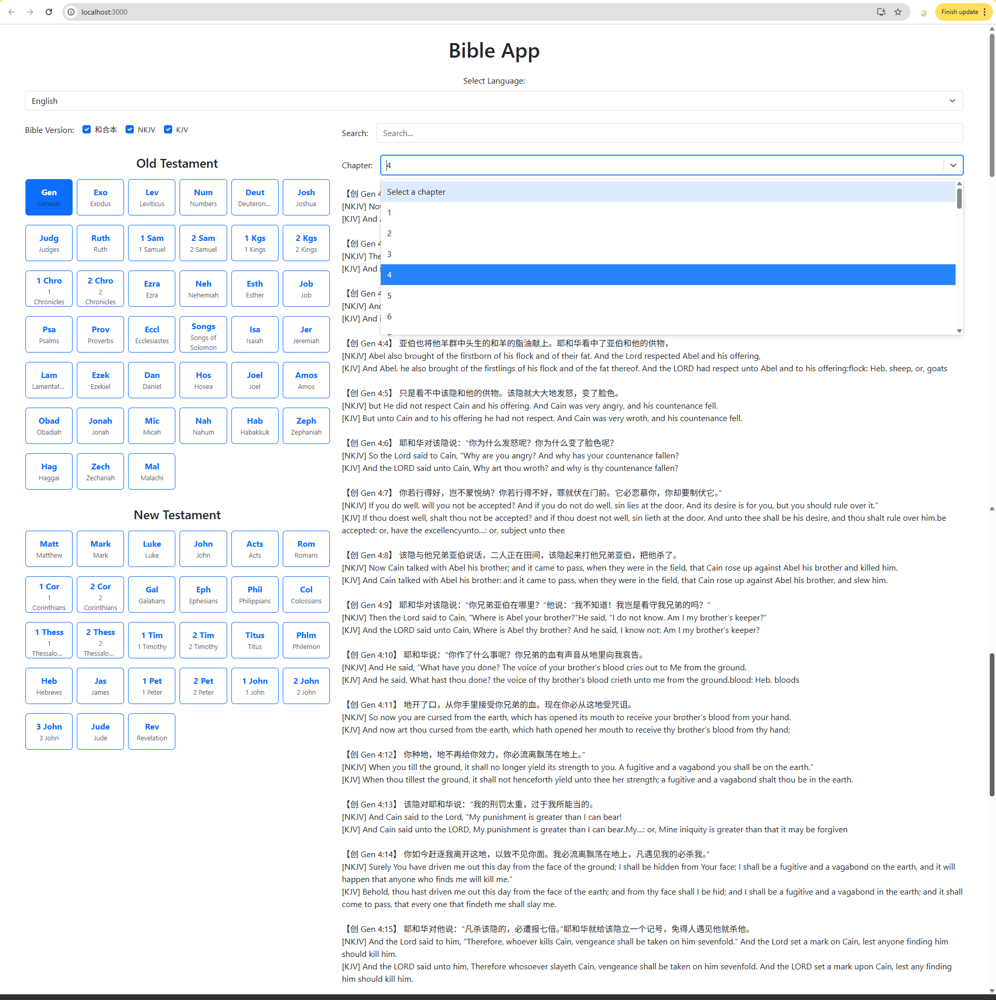

# Multilingual Bible Search Application

A full-stack bilingual Bible application built with React and Node.js/Express for inserting Bible verses into church documents quickly and efficiently.



## Why I Built This

**The Problem:**
I needed a tool to save time when inserting Bible verses into Word documents (.docx) for church sermons. The previous Bible app I used had several limitations:

- Could not highlight and copy Bible verses using mouse or keyboard shortcuts
- Did not include the English book name in the Bible verse format
- Did not follow my church's specific Bible verse insertion format
- Made it difficult to navigate to specific verses quickly

**The Solution:**
Built this application with the following improvements:

- **Easy Copy-Paste:** Highlight and copy verses using mouse or Ctrl+C/Cmd+C
- **Proper Formatting:** Includes book name, chapter, and verse in the correct format
- **Smart Chapter Selection:** Type chapter number or select from dropdown (helpful for books with many chapters)
- **Quick Navigation:** Use browser's built-in search (Ctrl+F/Cmd+F) to find specific chapter and verse
- **Bilingual Support:** Supports both English and Chinese, allowing non-Chinese speakers to help with Bible verse insertion in the future
- **Search Functionality:** Search for verses in Chinese or English based on selected Bible version

## Features

- Bilingual interface (English and Chinese)
- Three Bible versions: 和合本 (Chinese Union Version), NKJV, KJV
- Type or select chapter number from dropdown
- Easy copy-paste with proper formatting
- Search across selected Bible versions:
  - Search in Chinese when 和合本 is selected
  - Search in English when NKJV or KJV is selected
  - Multi-word search: finds verses containing all keywords
  - Example: Search "love God" finds verses with both "love" and "God"
- Browser search compatible (Ctrl+F/Cmd+F) for quick verse navigation
- Web browser optimized (desktop use)

## Technologies

**Frontend**
- React 18.3.1
- Bootstrap 5.3.3
- React Hooks (useState, useEffect, useCallback)

**Backend**
- Node.js
- Express.js
- CSV Parser

## Installation

```bash
# Clone the repository
git clone https://github.com/Christina-C11/bible-app.git
cd bible-app

# Install frontend dependencies
npm install

# Install backend dependencies
cd backend
npm install
cd ..

# Start the application
npm start
```

Application will run at:
- Frontend: http://localhost:3000
- Backend: http://localhost:5000

## How to Use

1. **Select Language** - Choose English or Chinese from the dropdown
2. **Select Bible Version** - Check one or more versions (和合本, NKJV, KJV)
3. **Select Book** - Click a book from Old Testament or New Testament
4. **Select Chapter** - Type chapter number or select from dropdown
5. **View Chapter** - All verses display with proper formatting

**Quick Navigation Tips:**

- Use browser search (Ctrl+F or Cmd+F) and type the chapter and verse number
- Example: Search "3:16" to jump to verse 16 in chapter 3
- For books with many chapters, type the chapter number directly instead of scrolling through the dropdown

**Search Functionality:**

1. Type keywords in the search box
2. Search automatically detects language:
   - Chinese keywords search 和合本 (if selected)
   - English keywords search NKJV/KJV (if selected)
3. Multi-word search: Type "love God" to find all verses containing both words
4. Results show all matching verses with book, chapter, and verse references
